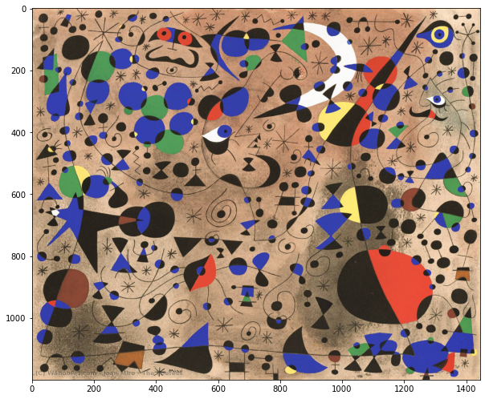

# KMeans Review

# Describe the process of the KMeans Algorithm

Question: What form do we need the target to be in?

> Your answer here

==SOLUTION== 
Trick question: this is unsupervised learning.  The KMeans algorithm does not require a target.

### Describe Step 1 (think initializations)

> Your answer here

==SOLUTION== 
The data scientist tells the KMeans algorithm how many clusters to find.  KMeans then initializes that many clusters in random points in the feature space.  By default, KMeans uses kmeans++, which "selects initial cluster centers for k-mean clustering in a smart way to speed up convergence." [source](https://scikit-learn.org/stable/modules/generated/sklearn.cluster.KMeans.html)

### Describe Step 2 (think distance)

> Your answer here

==SOLUTION==
The distance between each cluster center and each point is calculated. The distance metric can be changed, but is euclidean by default.

### Describe Step 3 (think assignment)

> Your answer here

==SOLUTION==
Each point is assigned to the closest cluster center. 

### Describe Step 4 (think updates)

> Your answer here

==SOLUTION==
New cluster centers are created for each group. These new centers are placed at the mean of the values assigned to each group.  

### When does the algorithm stop?

> Your answer here

==SOLUTION==

The process of label assignment repeats, adjusting the cluster centers each time.  Once the cluster centers no longer move (move less than a threshold), or a max number of iterations has been reached.

### Define inertia

> Your answer here

==SOLUTION==

The average of the sum of squared error over all classes.  Sum of squared errors is the square of the distance of each point from the respective cluster center added together.  Inertia is a metric that indicates how tightly packed a cluster is.  The lower the inertia the better. 

# Activity

Let's practice k-means clustering with an image of a piece of art. 


```python
# Our new clustering class
from sklearn.cluster import KMeans

import matplotlib.pyplot as plt
# Allows us to visualize images through matplotlib plot methods
import matplotlib.image as mpimg

# Old favorites
import pandas as pd
import numpy as np
```

Let's look at a colorful Miro painting with matplotlib.


```python
fig, ax = plt.subplots(figsize=(10,10))
img = mpimg.imread('data/miro.jpg')
imgplot = ax.imshow(img)
```


    

    


Question: What is the shape of the image, and what does each component represent?

==SOLUTION==  
1200 rows by 1445 columns.  Each element has 3 dimensions, which correspond to RGB values.


```python
# Code here
```


```python
#__SOLUTION__
img.shape
```


    (1200, 1445, 3)


```python
# Let's look at one pixel
```


```python
#__SOLUTION__
# put this array into https://www.colorhexa.com/ to see it is red
img[900,1200,:]
```


    array([235,  79,  57], dtype=uint8)


```python
# Flatten the image so that each row represents one RGB triad
img_reshape = None
```


```python
#__SOLUTION__
img_reshape = img.reshape(-1,3)

```


```python
# Check the shape
img_reshape.shape
```


    (1734000, 3)


```python
# after clustering, we will restore the original shape
# the code below demonstrates that the original image is restored by reshaping
# to the original dimensions 

fig, ax = plt.subplots(figsize=(10,10))
img = mpimg.imread('./data/miro.jpg')
restored_image = img_reshape.reshape(img.shape[0],img.shape[1], 3)
imgplot = ax.imshow(restored_image)


```


    

    


In a group we will use the KMeans algorithm to reduce the number of colors in the photo.   

Start by reducing the number of colors to 2.  To do so we will have to pass an appropriate argument  when instantianting a KMeans object.  The number of clusters we initiate will determine the number of colors that the image is reduced to.

In order to visualize the groupings, we will replace the original pixel values with the cluster centers associated with the assigned label.


```python
# Reminder of our flattened image
img_reshape.shape
```


```python
# Instantiate a KMeans object with the argument n_clusters equal to 2
# code here
km = None
```


```python
# Fit the km object to img_reshape
# code here
```


```python
# view the assigned labels via the labels_ attribute
# code here
```


```python
# view the cluster centers via the cluster_centers_ attribute
# code here
```


```python
# create a list which stores the cluster center associated with each label in a list.  
# The list should be 1734000 elements long

label_centers = []
for label in km.labels_:
    None
```


```python
# Convert list to array
centers_2 = np.array(label_centers)
```


```python
# check shape is (1734000, 3)
centers_2.shape
```


```python
# reshape to (1200, 1445, 3)
new_image_2 = None
new_image_2.shape
```


```python
# Run the cell below to plot the new image.  It should have only 2 colors
```


```python
fig, ax = plt.subplots(figsize=(10,10))
imgplot = ax.imshow(new_image_2.astype(int))
```

# On your own...
try out different numbers of clusters and see their affect on the painting.


```python
#your code here
```
